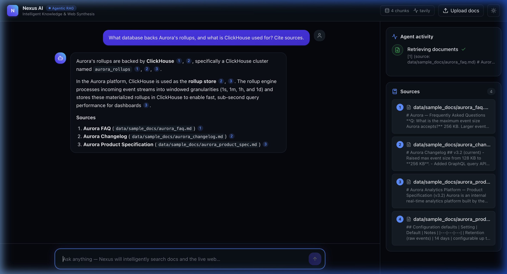
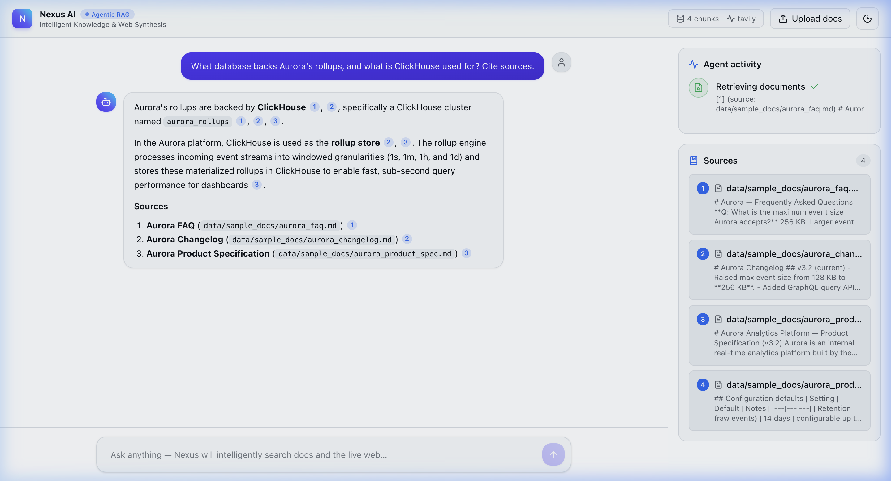
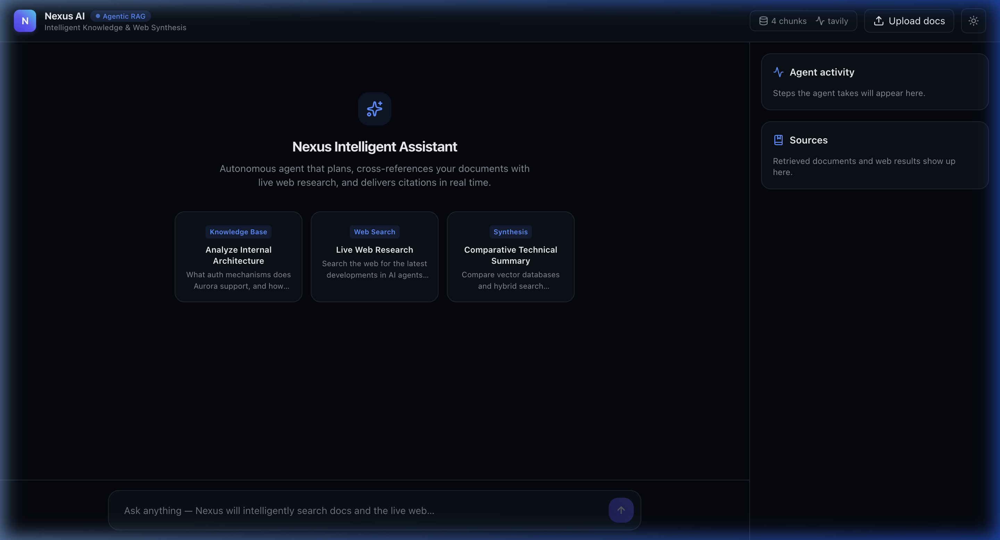
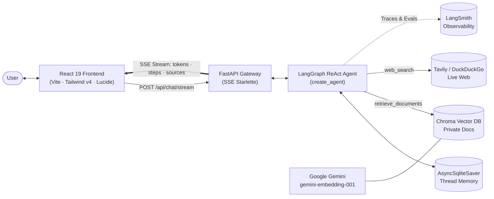
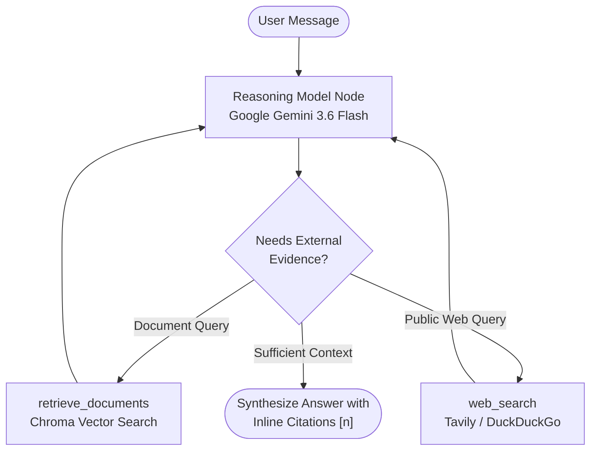
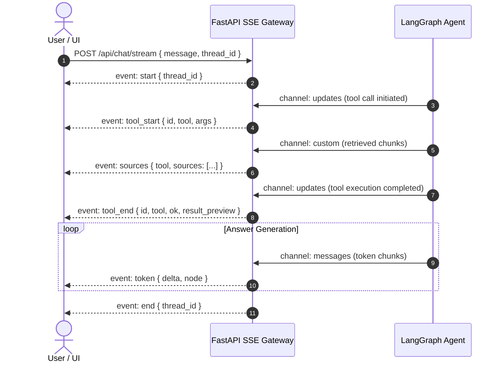

<div align="center">

  <h1>⚡ Nexus AI — Production Agentic RAG Assistant</h1>

  <p>
    <strong>An autonomous research &amp; synthesis agent powered by LangGraph, Google Gemini, Chroma vector store, and live web retrieval — streaming real-time tokens, tool executions, and cited sources to a sleek React 19 interface.</strong>
  </p>

  <p>
    <a href="https://www.python.org/"></a>
    <a href="https://fastapi.tiangolo.com/"></a>
    <a href="https://python.langchain.com/"></a>
    <a href="https://langchain-ai.github.io/langgraph/"></a>
    <a href="https://ai.google.dev/"></a>
    <a href="https://smith.langchain.com/"></a>
    <br/>
    <a href="https://react.dev/"></a>
    <a href="https://www.typescriptlang.org/"></a>
    <a href="https://tailwindcss.com/"></a>
    <a href="https://www.docker.com/"></a>
    <a href="./LICENSE"></a>
  </p>

  <p>
    
  </p>

</div>

---

## 📖 Table of Contents

- [Overview](#overview)
- [Key Features](#key-features)
- [Interface Showcase](#interface-showcase)
- [System Architecture](#system-architecture)
  - [High-Level Architecture](#high-level-architecture)
  - [Autonomous ReAct Control Loop](#autonomous-react-control-loop)
  - [Multi-Channel Streaming Contract](#multi-channel-streaming-contract)
- [Tech Stack](#tech-stack)
- [Quickstart](#quickstart)
  - [Running with Docker (Recommended)](#1-running-with-docker-recommended)
  - [Local Development Setup](#2-local-development-setup)
- [Configuration](#configuration)
- [API Reference](#api-reference)
- [Document Ingestion Pipeline](#document-ingestion-pipeline)
- [Observability & Evaluation (LangSmith)](#observability--evaluation-langsmith)
- [Engineering Design Decisions](#engineering-design-decisions)
- [Project Structure](#project-structure)
- [Author](#author)
- [License](#license)

---

<a id="overview"></a>
## 🌟 Overview

**Nexus AI** is a production-grade **Agentic Retrieval-Augmented Generation (RAG)** assistant designed to bridge the gap between static private documents and the real-time web. 

Traditional RAG pipelines follow a rigid single-turn heuristic: embed query &rarr; retrieve top-k chunks &rarr; answer. Nexus AI instead uses a **dynamic LangGraph ReAct agent**. The agent reasons over user prompts, dynamically determines whether to search your private knowledge base or fetch fresh public data via the web, evaluates whether retrieved evidence is sufficient, and synthesizes answers with verifiable numeric citations.

Every thought, tool execution, retrieved source, and token delta streams in real time over Server-Sent Events (SSE) into a React 19 interface, while production telemetry is logged automatically to **LangSmith**.

---

<a id="key-features"></a>
## ✨ Key Features

- 🤖 **Autonomous ReAct Agent Loop** — Built on LangGraph `create_agent` with stateful per-thread SQLite checkpointing. The agent can loop, refine its queries, and call multiple tools before synthesizing a final answer.
- 📚 **Dual Knowledge Retrieval** — Seamlessly searches a persisted Chroma vector store (PDF, Markdown, TXT) alongside live web search via Tavily (with automatic keyless DuckDuckGo fallback).
- ⚡ **Multi-Channel SSE Streaming** — Custom `astream` bridge multiplexing token deltas, tool start/end updates, and custom source payloads over a single HTTP connection.
- 🪄 **Sleek React 19 Dashboard** — Powered by Vite and Tailwind CSS v4, featuring:
  - **Live Agent Activity Timeline** tracking real-time status and latency.
  - **Interactive Sources Inspector** with collapsible source cards and snippet previews.
  - **Clickable Inline Citations (`[1]`, `[2]`)** that instantly jump to and highlight corresponding references.
  - **Built-in Document Ingestion Dialog** with drag-and-drop file upload.
  - **Polished Light & Dark Modes** with fluid transitions.
- 🔬 **Rigorously Evaluated via LangSmith** — Groundedness, retrieval relevance, correctness, and citation adherence benchmarked using `openevals` LLM-as-judge.
- 🐳 **Single-Origin Docker Delivery** — Unified `docker compose` configuration bundling the FastAPI backend and Nginx-proxied frontend with zero CORS friction.

---

<a id="interface-showcase"></a>
## 🖼️ Interface Showcase

### Dark & Light Mode Chat Experience

| Dark Mode (Default) | Light Mode |
|:---:|:---:|
|  |  |

### Clean Empty State & Suggested Prompts

<div align="center">
  
</div>

---

<a id="system-architecture"></a>
## 🏗️ System Architecture

<a id="high-level-architecture"></a>
### High-Level Architecture



<a id="autonomous-react-control-loop"></a>
### Autonomous ReAct Control Loop



<a id="multi-channel-streaming-contract"></a>
### Multi-Channel Streaming Contract

The FastAPI backend runs `agent.astream(stream_mode=["messages", "updates", "custom"])` and projects LangGraph internal channels onto clean SSE events:



| Event | LangGraph Channel | Payload Description |
|---|---|---|
| `start` | Lifecycle | `{ "thread_id": string }` |
| `tool_start` | `updates` | `{ "id": string, "tool": string, "args": object }` |
| `sources` | `custom` | `{ "tool": string, "sources": [{ "id": string, "kind": string, "title": string, "url"?: string, "snippet": string }] }` |
| `tool_end` | `updates` | `{ "id": string, "tool": string, "ok": boolean, "result_preview": string }` |
| `token` | `messages` | `{ "delta": string, "node": "model" }` (incremental answer delta) |
| `error` | Lifecycle | `{ "message": string, "fatal": boolean }` |
| `end` | Lifecycle | `{ "thread_id": string }` |

---

<a id="tech-stack"></a>
## 🧰 Tech Stack

| Domain | Technologies |
|---|---|
| **Agent Orchestration** | [LangGraph 1.2](https://langchain-ai.github.io/langgraph/) (`create_agent`, `AsyncSqliteSaver`), [LangChain 1.3](https://python.langchain.com/) |
| **Foundation Models** | [Google Gemini](https://ai.google.dev/) (`gemini-3.6-flash`), `models/gemini-embedding-001` |
| **Knowledge Retrieval** | [Chroma DB 1.5](https://www.trychroma.com/), `RecursiveCharacterTextSplitter`, [Tavily AI](https://tavily.com/), [DuckDuckGo Search](https://duckduckgo.com/) |
| **Backend Framework** | [FastAPI](https://fastapi.tiangolo.com/), `sse-starlette`, `pydantic-settings`, [uv](https://docs.astral.sh/uv/), Python 3.12 |
| **Frontend Architecture** | [React 19](https://react.dev/), [Vite 8](https://vite.dev/), [TypeScript 6](https://www.typescriptlang.org/), [Tailwind CSS v4](https://tailwindcss.com/), [Lucide React](https://lucide.dev/), Shiki |
| **Observability & Evals** | [LangSmith 0.8](https://smith.langchain.com/), `openevals` LLM-as-judge |
| **Infrastructure** | Docker, Docker Compose, Nginx Reverse Proxy |

---

<a id="quickstart"></a>
## 🚀 Quickstart

<a id="1-running-with-docker-recommended"></a>
### 1. Running with Docker (Recommended)

The simplest way to spin up the entire application stack is with Docker Compose:

```bash
# Clone the repository
git clone https://github.com/kamesh-rautiya/Agentic-Rag-Assistant.git
cd Agentic-Rag-Assistant

# Set up environment variables
cp .env.example .env
```

Export your Google Gemini API key:
```bash
export GOOGLE_API_KEY="your-gemini-api-key"
```

Start both backend and frontend containers:
```bash
docker compose up -d --build
```

Access the services:
- **Web UI:** [http://localhost:8080](http://localhost:8080)
- **API Health Check:** [http://localhost:8000/api/health](http://localhost:8000/api/health)

View live logs:
```bash
docker compose logs -f
```

---

<a id="2-local-development-setup"></a>
### 2. Local Development Setup

#### Backend Setup

```bash
# Install uv package manager if needed
curl -LsSf https://astral.sh/uv/install.sh | sh

# Sync dependencies and activate environment
uv sync

# Start the FastAPI development server
uv run uvicorn rag_agent.api:app --reload --port 8000
```

#### Frontend Setup

```bash
# In a new terminal tab
cd frontend

# Install Node dependencies
npm install

# Start Vite dev server (proxies /api to :8000)
npm run dev
```

Visit [http://localhost:5173](http://localhost:5173) in your browser.

---

<a id="configuration"></a>
## ⚙️ Configuration

Nexus AI is configured through environment variables defined in `.env`:

| Variable | Required | Default | Description |
|---|:---:|---|---|
| `GOOGLE_API_KEY` | ✅ | — | Google Gemini API key for LLM generation & embeddings |
| `TAVILY_API_KEY` | ➖ | — | Tavily web search key (falls back to DuckDuckGo if omitted) |
| `MODEL_FAST` | ➖ | `gemini-3.6-flash` | High-efficiency routine model |
| `MODEL_HEAVY` | ➖ | `gemini-3.6-flash` | Reasoning and synthesis model |
| `EMBEDDING_MODEL` | ➖ | `models/gemini-embedding-001` | Embedding model for Chroma vector store |
| `RETRIEVER_K` | ➖ | `4` | Number of document chunks retrieved per tool call |
| `CHROMA_DIR` | ➖ | `./chroma_db` | Persistent vector store directory |
| `SQLITE_PATH` | ➖ | `./memory.sqlite` | SQLite database path for thread memory |
| `LANGSMITH_TRACING` | ➖ | `false` | Set to `true` to enable automatic LangSmith tracing |
| `LANGSMITH_API_KEY` | ➖ | — | LangSmith API key |
| `LANGSMITH_PROJECT` | ➖ | `resume-demo-rag-agent` | LangSmith project tracking name |

---

<a id="api-reference"></a>
## 🔌 API Reference

### 1. Health & Capabilities
```http
GET /api/health
```

**Example Response:**
```json
{
  "status": "ok",
  "model_fast": "gemini-3.6-flash",
  "model_heavy": "gemini-3.6-flash",
  "embedding_model": "models/gemini-embedding-001",
  "web_backend": "tavily",
  "langsmith_tracing": false,
  "documents_indexed": 4
}
```

### 2. Document Ingestion
```http
POST /api/ingest
Content-Type: multipart/form-data
```

**Example Request:**
```bash
curl -X POST http://localhost:8000/api/ingest \
  -F "files=@my_document.pdf"
```

**Example Response:**
```json
{
  "chunks_added": 8,
  "files": ["my_document.pdf"]
}
```

### 3. Real-Time Chat Stream (SSE)
```http
POST /api/chat/stream
Content-Type: application/json
```

**Example Request:**
```bash
curl -N -X POST http://localhost:8000/api/chat/stream \
  -H "Content-Type: application/json" \
  -d '{"message":"What database backs Aurora rollups? Cite sources."}'
```

### 4. User Feedback
```http
POST /api/feedback
Content-Type: application/json
```

**Example Request:**
```bash
curl -X POST http://localhost:8000/api/feedback \
  -H "Content-Type: application/json" \
  -d '{
    "run_id": "910a2fb6-eaca-424e-8018-90a1d43b342e",
    "score": 1,
    "comment": "Accurate response with valid citations"
  }'
```

---

<a id="document-ingestion-pipeline"></a>
## 📄 Document Ingestion Pipeline

On initial startup, the backend automatically ingests sample documents from `data/sample_docs/` into Chroma vector storage.

```
Document (PDF / Markdown / TXT)
            │
            ▼
PyPDFLoader / TextLoader
            │
            ▼
RecursiveCharacterTextSplitter (chunk_size: 800, overlap: 100)
            │
            ▼
Google Generative AI Embeddings (gemini-embedding-001)
            │
            ▼
Chroma Vector Database (Collection: "documents")
```

Users can ingest additional custom documentation at any time through the **Upload docs** button in the header.

---

<a id="observability--evaluation-langsmith"></a>
## 🔬 Observability & Evaluation (LangSmith)

When `LANGSMITH_TRACING=true` and `LANGSMITH_API_KEY` are configured, every agent run, tool call, token count, and latency metric is automatically captured in LangSmith without manual instrumentation.

### Running Offline Evaluations

```bash
# 1. Seed the evaluation benchmark dataset in LangSmith
uv run python -m evals.create_dataset

# 2. Run the automated evaluation suite
uv run python -m evals.run_evals

# 3. Run pairwise model comparison experiments
uv run python -m evals.run_pairwise
```

### Benchmark Results (12 Golden Test Cases)

| Evaluator | Metric Score | Evaluation Method |
|---|:---:|---|
| **Correctness** | `1.00` | LLM-as-judge comparison against golden references |
| **Retrieval Relevance** | `0.92` | Precision of retrieved context against user query |
| **Groundedness** | `0.75`* | Faithfulness of generated answer to retrieved chunks |
| **Citation Adherence** | `1.00` | Automated regex heuristic verifying `[n]` citation mapping |

*\*Groundedness is 0.75 by design: general-knowledge queries are answered via web search and do not require grounding in local document contexts.*

---

<a id="engineering-design-decisions"></a>
## 🧩 Engineering Design Decisions

- **`create_agent` instead of a static DAG**: Real-world research queries often require dynamic follow-up retrieval. A prebuilt tool-calling ReAct agent provides the ideal level of abstraction while maintaining streamability and tracing.
- **Deriving Tool Events from `updates` Channel**: In LangGraph, streaming tool call argument deltas from the `messages` channel can be fragmented. Deriving `tool_start` and `tool_end` from the `updates` channel guarantees verified, well-formed tool execution payloads.
- **SSE with POST (`fetch` + `ReadableStream`)**: Native browser `EventSource` only supports `GET` queries. Nexus AI uses a `fetch` POST bridge with custom SSE chunking to support rich request payloads and thread session identifiers.
- **Graceful Search Fallback**: When `TAVILY_API_KEY` is not present, the agent automatically falls back to keyless DuckDuckGo search without failing or crashing.

---

<a id="project-structure"></a>
## 📂 Project Structure

```
agentic-rag-assistant/
├── data/
│   └── sample_docs/              # Demo document corpus (Aurora Analytics Platform)
├── docs/
│   ├── hero-dark.png             # Full UI screenshot (Dark mode)
│   ├── chat-light.png            # Full UI screenshot (Light mode)
│   └── empty-state.png           # Suggested prompts and initial state
├── evals/
│   ├── create_dataset.py         # LangSmith evaluation dataset creation
│   ├── run_evals.py              # Automated LLM-as-judge benchmark runner
│   └── run_pairwise.py           # Side-by-side model comparison experiment
├── frontend/
│   ├── src/
│   │   ├── components/           # Chat, Timeline, Sources, and AppShell UI
│   │   ├── hooks/                # useAgentStream SSE state machine
│   │   ├── lib/                  # API client & SSE parser
│   │   └── App.tsx               # Main application component
│   ├── package.json
│   └── vite.config.ts
├── src/
│   └── rag_agent/
│       ├── agent.py              # LangGraph ReAct agent & prompt definition
│       ├── api.py                # FastAPI routes (/health, /ingest, /chat/stream)
│       ├── config.py             # Pydantic application settings
│       ├── embeddings.py         # Google Gemini embedding client
│       ├── ingest.py             # Document loaders & chunking logic
│       ├── llms.py               # Gemini chat model factory
│       ├── streaming.py          # Multi-channel LangGraph to SSE bridge
│       ├── tools.py              # Chroma retrieval & Web search tools
│       └── vectorstore.py        # Chroma persistent vector store provider
├── docker-compose.yml            # Multi-container orchestration
├── Dockerfile.backend            # FastAPI backend container
├── pyproject.toml                # Python project definition & dependencies
└── README.md                     # Project documentation
```

---

<a id="author"></a>
## 👤 Author

**Kamesh**
- GitHub: [@kamesh-rautiya](https://github.com/kamesh-rautiya)

---

<a id="license"></a>
## 📄 License

This project is licensed under the [MIT License](./LICENSE) © 2026 Kamesh.
